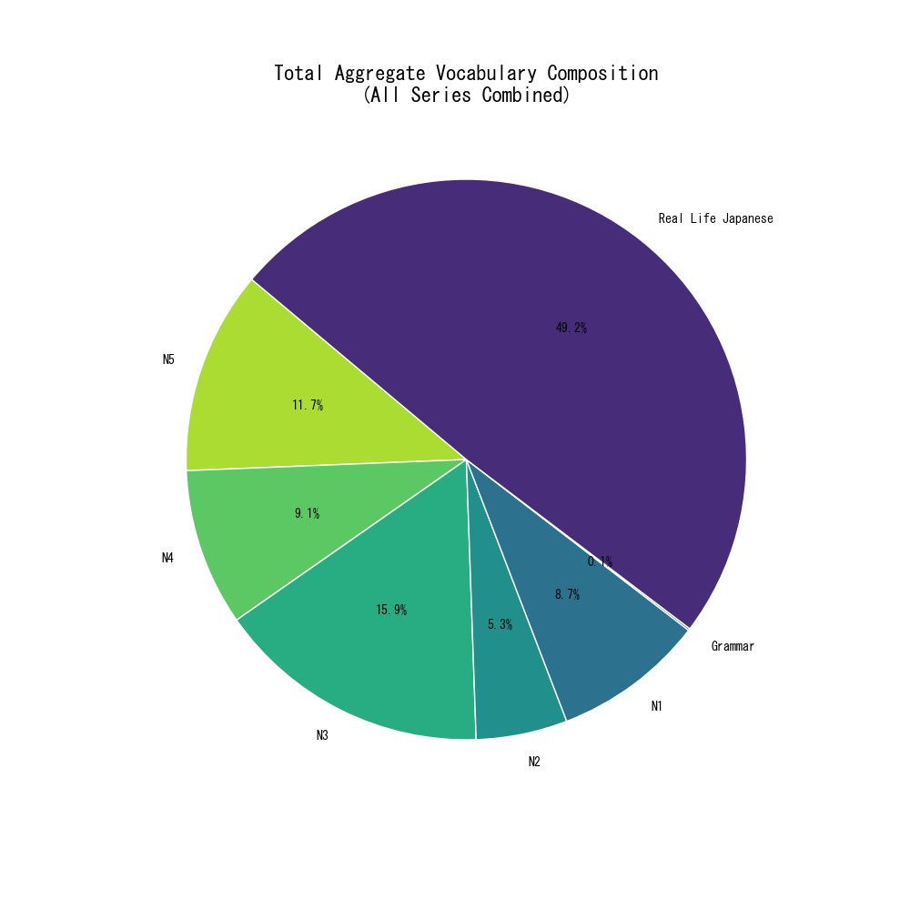
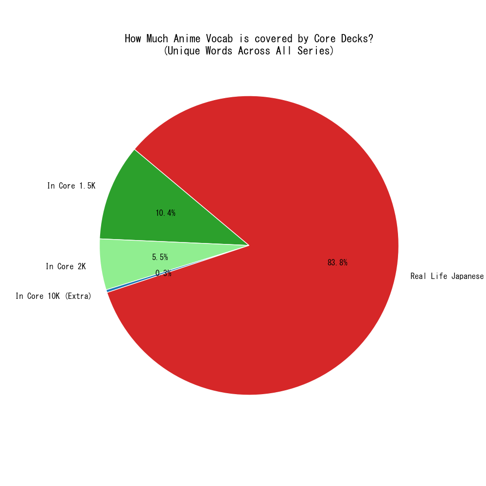

# Anime to Anki (A2A)

A Python-powered pipeline to transform anime transcripts into optimized, high-frequency Anki decks. While other tools exist, this project is built for the learner who values full control and offline portability.

## Features

* **Dual-Deck Generation:** Automatically creates both a Vocabulary deck and a Sentence deck.
* **Proper Noun Handling:** Detects character names (like Mio or Yui) and provides the Romaji reading as the definition instead of a literal dictionary entry.
* **Clean Formatting:** Includes modern sans-serif fonts and Furigana hover effects for better readability on mobile.

## Frequently Asked Questions

### Q: Is this basically a local version of jpdb?

**A:** Yes.

### Q: Isn't jpdb way better?

**A:** Yeah.

### Q: How long would it take for me to make my own deck

**A:** Give or take 25 minutes. There are a lot of words in these shows.

### Q: What's the point then?

**A:** I paid 25 dollars for AnkiMobile, and I am going to use Anki as much as humanly possible. Plus jpdb doesn't have a dedicated mobile app, and I need my studies to be available offline on my phone.

As to why I want anime decks instead of using just a Core 10K list? Real life Japanese people don't speak textbook. If you're learning to pass a test that's one thing but if you're learning to learn then you're gonna have to consume Japanese media. That's how you learn the best Japanese. [Go read theory.](https://learnjapanese.moe/guide/#26-beginner-immersion-an-uphill-battle)

You're gonna be talking about random stuff like chocolate cornets or watching a beautiful sunset or going to concerts all the time. When's the last time you had a meaningful conversation about the weather?

### Q: What words do the decks contain?
**A:** The decks have every single word that's said in the anime minus the ones in the core 1.5K deck. They're sorted in order based on frequency so something like こなた - Konata (Lucky Star) or "ナルト" - "Naruto Run" (Naruto)  while something like "ふうし" -satire (satire) will be later in the deck.

### Q: How good are the decks?
**A:** To be fair im not very good at Japanese so I cannot vet the accuracy of the cards. I use jamdict and jisho so if its bad blame them not me.

### Q: I downloaded some of your decks and now I have 12 ない cards 
Given this is Anki and not jpdb obviously there's gonna be doubles from any core decks or just other decks you have in general. If you download more than one of these decks you're most definitely going to have repeats. If you have a duplicate just delete them. Browse > Notes > Find Duplicates

## Setup

1. Place your `.srt` transcripts in the `transcripts/[Show Name]/` folder.
2. Ensure you have `JLPTWords.json` in the root directory for level tagging.
3. Run the script to generate your `.apkg` files fount at `react-anime/public/anki`.
4. Import the resulting `.apkg` into Anki.

---

### Alternative: Pre-built Decks

If you just want the Anki files for the shows I have already processed, check out the GitHub Pages site at:
[jadonkjones.github.io/AnimeExtractor](jadonkjones.github.io/AnimeExtractor)

